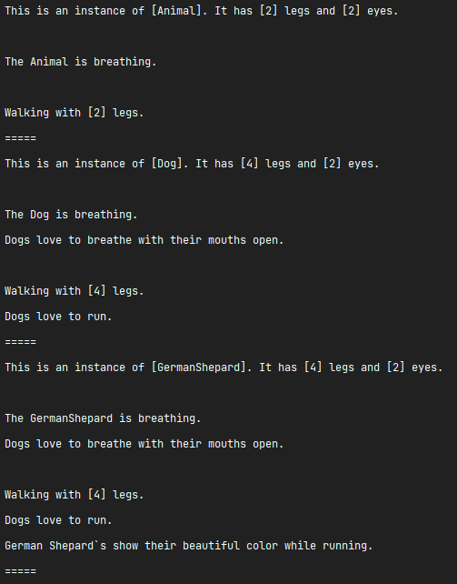

# Python OOP Concepts - Animal Reign

In this exercise we will check how inheritance in Python and the usage of the **_super()_** built-in method and **_self_** work.

### Overview of animal.py:
- The **_Animal_** class represents an ordinary animal. It contains the _**number_of_legs**_ and the **_number_of_eyes_** 
of an animal, as well as some of its behavior through the methods **_breathe()_** and **_walk()_**.
It also contains the **method _summary()_**, which just summarizes the information of the current animal 
instance.
- No extra action should be taken here.

### Overview of dog.py:
- Since every dog has 4 legs and two eyes, the **constructor** method should make a call to the 
  **Animal** constructor, passing the correspondent values to the constructor.
- You should override the **_breathe()_** method. It should call the **_breathe()_** method of the Animal class and 
  then print `"Dogs love to breathe with their mouths open."`.
- You should override the **_walk()_** method. It should call the **_walk()_** method of the Animal class and then 
  print `"Dogs love to run."`.

### Overview of german_shepard.py:
- You should override the **_walk()_** method. It should call the **_walk()_** method of the Dog class and then
  print ``"German Shepard`s show their beautiful fur while running."``.

### Overview of animal_reign.py:
- Where the main method resides, therefore where your code should be executed. An animal (human), a dog and a german 
  shepard instances are created. 
- No extra action should be taken here.

You should have an output similar to the one below:

